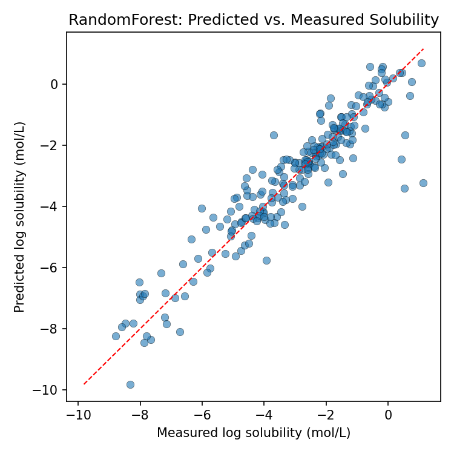

# QSAR Aqueous Solubility Predictor

A cheminformatics / machine learning pipeline that predicts a compound's
aqueous solubility directly from its molecular structure — a classic
QSAR (Quantitative Structure-Activity Relationship) task and a core part
of early-stage ADMET triage in drug discovery.

## Dataset

[ESOL (Delaney, 2004)](https://pubs.acs.org/doi/10.1021/ci034243x) — 1,128
organic compounds with SMILES and measured aqueous solubility (log mol/L),
pulled from the [DeepChem / MoleculeNet](https://github.com/deepchem/deepchem)
benchmark collection. A well-established, citable cheminformatics benchmark.

## Pipeline

```
fetch_dataset.py   Download the ESOL dataset -> data/esol_raw.csv
featurize.py        RDKit: compute 11 physicochemical descriptors per
                     compound (MW, LogP, TPSA, H-bond donors/acceptors,
                     rotatable bonds, ring counts, fraction Csp3, molar
                     refractivity) -> data/esol_features.csv
train_model.py       Train Linear Regression + Random Forest, evaluate
                     with held-out test set + 5-fold CV, save the better
                     model -> models/solubility_model.joblib
predict.py            CLI: predict solubility for any new SMILES string
```

## Setup

```bash
conda env create -f environment.yml
conda activate qsar
```

## Run

```bash
python fetch_dataset.py
python featurize.py
python train_model.py
python predict.py "CC(=O)Oc1ccccc1C(=O)O"   # predict for any SMILES, e.g. aspirin
```

## Results

Trained on 902 compounds, evaluated on a held-out 226-compound test set:

| Model | Test RMSE | Test R² | 5-fold CV R² |
|---|---|---|---|
| Linear Regression | 1.033 | 0.774 | 0.792 ± 0.028 |
| **Random Forest** | **0.787** | **0.869** | **0.893 ± 0.016** |

The Random Forest model (saved as the production model) explains ~87% of
the variance in measured aqueous solubility using only simple RDKit
descriptors — in line with published ESOL benchmark results using
descriptor-based (non-graph-neural-network) models.



## Why these choices

- **RDKit** for all featurization — the standard open-source
  cheminformatics toolkit, and the same one used in the companion
  [molecular-docking-pipeline](https://github.com/aurkos/molecular-docking-pipeline)
  project.
- **Physicochemical descriptors over fingerprints** for interpretability —
  each feature (LogP, TPSA, H-bond counts, etc.) has a direct physical
  meaning, which matters for explaining predictions in a drug discovery
  context, not just maximizing accuracy.
- **Random Forest** over more complex models — a strong, well-validated
  baseline for small structured cheminformatics datasets, and avoids
  overfitting on ~1,100 compounds.

## Status

Built as a portfolio project demonstrating applied cheminformatics and
machine learning for molecular property prediction (QSAR/ADMET-style
modeling), for internship applications in computational chemistry /
modeling & informatics.
